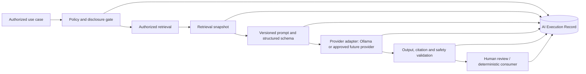

# Explainable AI Architecture

## Role of AI

AI assists investigation, retrieval, extraction, comparison, summarization, and recommendation drafting. It does not establish truth, approve evidence, accept risk, authorize a control exception, or make the accountable final decision. Material AI outputs are proposals until reviewed under the applicable workflow.

**Current.** DecisionVault optionally calls local Ollama for `nomic-embed-text` embeddings and `llama3.2` generation. Retrieval combines tenant/authorization-filtered lexical and vector results with Knowledge Card trust. Generated answers are instructed to cite evidence. When Ollama is unavailable, embeddings may be absent and answers fall back to deterministic grounded text. Current audit records only an answered question and evidence count; there is no prompt/model registry or AIExecutionRecord.

## Target orchestration



The AI Orchestration module owns use-case policy, provider adapters, model and prompt registries, execution, structured-output validation, guardrails, citations, execution records, evaluations, and cost/latency accounting. Search owns authorized retrieval; Knowledge/Evidence own governance; Decision owns recommendation acceptance and state; Identity owns authorization.

## Execution contract

An `AIExecutionRecord` contains:

- tenant, use-case, initiating human/service, correlation/causation, subject and workflow stage;
- provider, endpoint/region classification, model name and immutable version/digest where available;
- prompt template ID/version/hash, system instructions, parameters, structured-output schema version;
- authorized input references and content/version hashes, not necessarily duplicated sensitive content;
- retrieval query/version, filters/policy context, ordered result IDs/versions/chunks/scores, index/embedding model version;
- raw provider response under retention policy, validated structured output, citations, confidence/uncertainty and validation failures;
- start/end, latency, token/compute/cost estimates, status and deterministic fallback used;
- reviewer, disposition, corrections, override rationale and final linked recommendation/snapshot.

Records are append-only facts. Retention can separate sensitive payload storage from durable metadata and hashes. Provider version uncertainty is recorded as uncertainty, never invented.

## Retrieval and citations

Authorization, tenant, clearance, access policy, lifecycle, AI eligibility, effective date, and decision-time cutoff filter candidates before ranking. Hybrid retrieval can combine lexical/vector results, but the scoring formula and versions are recorded. Reranking must not reintroduce filtered content.

A citation identifies an exact Evidence or Knowledge Asset version and locator/chunk, with content hash and access check. Validators confirm cited inputs were in the retrieval snapshot and that important structured claims have support. Missing and contradictory evidence are first-class output fields. Citation presence alone does not prove entailment; evaluation and human review remain necessary.

## Structured recommendation and explanation

The required output schema includes:

```text
Observation
Evidence citations
Relevant knowledge
Risk
Policy or control alignment
Recommendation
Confidence and basis
Business impact
Missing or conflicting information
Required human action
Required approver role
```

Confidence is calibrated for a defined use case and is distinct from retrieval similarity, evidence trust, readiness, or Enterprise Confidence. The explanation exposes rule contributions, evidence coverage/quality, conflicts, uncertainty, model limitations, and deterministic calculations. An opaque generated “AI score” is prohibited.

## Prompt and model registries

Published prompt templates are immutable versions with owner, purpose, input/output schemas, allowed data classifications/providers, required citations, evaluation suite, approval, release date, and retirement status. Model registry entries describe provider/model/digest, capabilities, context limits, residency/retention terms, approved classifications/use cases, benchmark results, known limitations, cost/latency, and status.

Configuration selects an approved prompt/model pair by use case and tenant policy. Changes require evaluation and release; active decisions/snapshots retain the prior version. Emergency disablement is immediate and audited.

## Provider adapters and operation modes

The provider interface supports embeddings and structured generation without leaking provider-specific types into domain modules. Ollama remains the local adapter. Future external adapters require security, privacy, legal, residency, retention/training, availability, cost, and evaluation approval.

Every use case declares modes:

- **AI enabled:** approved model performs the bounded task.
- **Deterministic fallback:** lexical search, rules, templates, or unavailable notice supplies a safe result.
- **Model disabled:** core decision, evidence, workflow, approval, audit, and reporting functions remain operational.

AI-disabled operation is a supported platform mode, not merely an outage response. AI unavailability or tenant policy cannot silently skip required evidence or approvals. Long executions use durable jobs with timeout, cancellation, idempotency, retry classification, and redacted failure messages.

## Guardrails and prompt injection

Retrieved/uploaded text is untrusted content. Templates delimit it as data, ignore embedded instructions, minimize context, and separate trusted system policy. Tools/connectors are allowlisted with typed inputs, resource-scoped credentials, URL/domain controls, and human confirmation before consequential writes. Outputs are schema-validated, size-limited, scanned for unsupported citations and sensitive disclosure, and rejected safely on validation failure.

No autonomous self-training, prompt mutation, model switching, or score-weight change is permitted. Conversational memory, if introduced, is tenant/object scoped, classified, expiring, inspectable, and never an authorization source.

## Evaluation and release gates

Evaluation layers include deterministic contract tests; retrieval relevance/recall and authorization leakage tests; citation precision/entailment; structured-output validity; missing/conflict detection; hallucination and prompt-injection resistance; fairness and domain-specific harms where applicable; latency/cost; and human reviewer agreement/outcome monitoring.

Datasets are versioned, authorized, de-identified where possible, provenance-tracked, and separated by tenant unless explicit approved aggregation exists. A model/prompt release has baseline and regression thresholds, named approver, rollback/disable plan, canary or shadow strategy as maturity warrants, and production monitoring. Outcome signals propose evaluated improvements; they do not update production silently.

## Decision-time reproducibility

Exact byte-for-byte reproduction may be impossible for nondeterministic or changing hosted models. DecisionVault therefore retains sufficient inputs, versions/digests, parameters, retrieval order, response, validation result, and hashes to reconstruct and explain the original execution. Where exact replay is required, use immutable local model artifacts and deterministic settings where supported. Replay creates a new execution record and never overwrites history.

## Observability and governance

Track execution count/status, latency, token/compute/cost, fallback rate, retrieval quality, citation validity, reviewer acceptance/correction/override, incident rate, and outcome correlation—scoped and access-controlled. Logs exclude source/prompt/output content by default. Model Risk, Security, Privacy, Legal/Compliance, domain owners, and accountable business owners approve policies proportional to use-case risk.

Open questions include acceptable providers and data classes, model artifact retention, exact-reproduction requirements, evaluation ownership/thresholds, provider cost allocation, high-risk prohibited uses, and whether prompt/output retention conflicts with privacy or legal-hold obligations.
