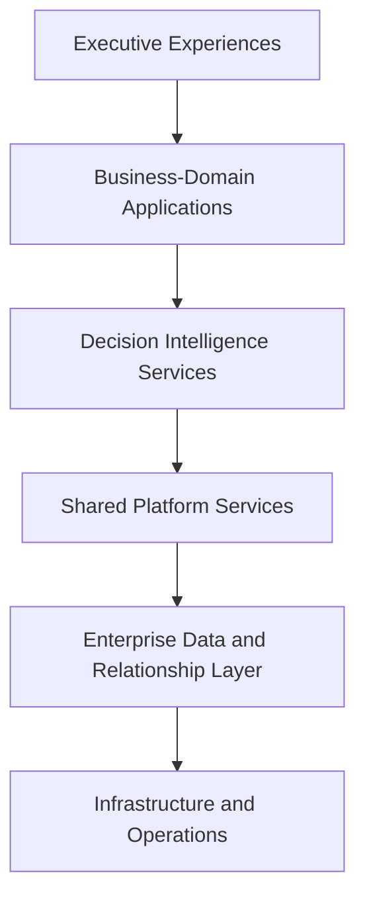
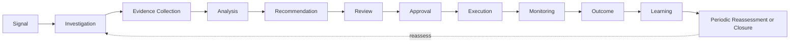

# DecisionVault Platform Blueprint

**Status:** Target architecture with current-state baseline  
**Date:** 2026-08-06  
**Positioning:** **DecisionVault — The Enterprise Decision Intelligence Platform**

> DecisionVault manages enterprise confidence through connected decisions, governed evidence, organizational knowledge, enterprise risks and controls, explainable AI, human accountability, and measurable outcomes.

This blueprint is directional. Labels have precise meanings: **Current** is verified in this repository; **Transitional** is the recommended next architecture; **Target** is the intended enterprise capability; **Future** is conditional and not committed scope.

## 1. Executive architecture summary

DecisionVault exists because material decisions are commonly fragmented across documents, tickets, email, dashboards, and specialist systems. That fragmentation makes it difficult to establish what was known, why a recommendation was made, who accepted accountability, whether required controls were satisfied, and whether the outcome justified the decision.

The platform connects decisions to governed evidence, knowledge, risks, controls, policies, approvals, explanations, and outcomes. Primary users include chief risk, compliance, information, information-security, operating, and legal officers; Internal Audit; business and risk owners; analysts; reviewers; and accountable approvers.

DecisionVault differs from:

- document management, because source repositories remain authoritative and the platform governs decision context and evidence;
- ticketing and workflow, because transitions support a traceable decision model rather than being the product's primary record;
- generic AI assistants, because authorization precedes retrieval and outputs must be cited, reproducible, reviewed, and tied to accountable action;
- domain-only applications, because shared platform capabilities support versioned industry Decision Packs.

Enterprise confidence is not a single opaque score. It is the inspectable, scoped state of decision quality, evidence fitness, policy and control alignment, accountability, and demonstrated outcomes.

Illustrations may use a regulated enterprise-payments archetype—for example merchant onboarding, fraud escalation, PCI obligations, and third-party risk. This is not a reference to any actual customer, endorsement, partnership, or non-public information.

### Primary reference scenario

The primary design test is a large, regulated financial-services/payments enterprise archetype with multiple legal entities and business units. A merchant-risk signal or control failure becomes a tenant-bound Enterprise Event; a versioned merchant onboarding or fraud-escalation template opens or reassesses a Decision; evidence is checked for freshness, authority, AML/KYC or PCI requirement coverage, and access classification; risks and control effectiveness shape a cited Recommendation; the accountable business/risk roles review and approve; and observed fraud, compliance, operational, financial, and customer outcomes close the loop. The same shared services must support healthcare, life sciences, manufacturing, technology, and professional-services packs without embedding payments fields in the core model.

## 2. Architecture principles

1. Tenant isolation is mandatory.
2. Human accountability cannot be delegated to AI.
3. AI recommendations must be explainable and cited.
4. Decision history and audit records must be durable.
5. Historical decisions must remain reproducible.
6. Scores must expose inputs, weights, rules, and versions.
7. Capabilities used by multiple domains belong in the shared platform.
8. Prefer a modular monolith until operational scale justifies distribution.
9. Prefer explicit domain models over a universal-object design.
10. Configuration does not replace domain validation.
11. Every structural change must leave the application deployable.
12. Security and governance are architectural concerns.
13. Outcomes close the decision-learning loop.
14. Current and proposed architecture must never be conflated.
15. Pre-customer breaking changes are acceptable only when deliberate and coordinated.

## 3. Current foundation

**Current.** The repository contains a Next.js frontend, FastAPI backend, PostgreSQL 16 with pgvector, a Python polling worker, shared file storage, and optional host-based Ollama. Docker Compose runs the application. On Linux, Apache is the HTTPS entry point; backend and frontend bind only to localhost, while PostgreSQL and the worker publish no host ports.

The implemented ownership chain is Tenant → Organization → Workspace. Authentication uses password hashes, JWTs, revocable sessions, membership, roles, permissions, clearance ranks, classifications, and access policies. Tenant identity is derived from the authenticated principal and tenant isolation is application-enforced; PostgreSQL row-level security is not implemented.

Implemented product areas include Workspaces, Business Concepts, source ingestion, draft and approved Knowledge Cards, extracted chunks, evidence, hybrid retrieval, grounded questions, Decision Cases, transparent readiness calculations, Audit Events, an Executive Dashboard, and a Decision Workspace. The current Decision Case remains supplier-oriented in several attributes and seeded scenarios; it is not yet the target generic Decision model.

The worker claims queued jobs with row locking, extracts supported content without OCR, creates draft knowledge/evidence/chunks, and attempts embeddings. Ollama failure degrades to lexical retrieval and deterministic summaries. Startup creates tables directly; there is no migration framework. See [the descriptive current architecture](../ARCHITECTURE.md) and [the pre-release schema policy](../adr/ADR-0001-pre-release-breaking-changes.md).

## 4. Layered platform



| Layer | Ownership and boundary | Allowed dependencies |
| --- | --- | --- |
| Executive Experiences | Portfolio health, confidence drill-down, exceptions, outcomes, and audit views. No business rules. | Domain application APIs and analytics read models. |
| Business-Domain Applications | Decision Packs and domain terminology, templates, evidence requirements, risk taxonomies, workflows, and reports. | Decision intelligence and shared services; never bypass security or write shared data directly. |
| Decision Intelligence Services | Decisions, recommendations, explanations, evidence fitness, Decision DNA, outcomes, and learning. | Shared platform contracts and owned repositories. |
| Shared Platform Services | Identity, tenancy, knowledge, evidence, policy, risk/control, workflow, approval, audit, relationships, search, AI orchestration, notifications, reporting, jobs, and files. | Enterprise data layer through explicit repositories. |
| Enterprise Data and Relationship Layer | Transactional records, versions, snapshots, edges, search indexes, embeddings, and analytics projections. | PostgreSQL/pgvector first; storage adapters. |
| Infrastructure and Operations | Compose, worker runtime, storage, Ollama, Apache, delivery, backup, health, logs, metrics, and traces. | No domain ownership. |

**Transitional.** Implement these as cohesive modules inside the FastAPI deployable, with repository and service contracts and an outbox-backed worker. Independently deployed services require measured scaling, isolation, release-cadence, or ownership pressure—not conceptual boundaries alone.

Decision Packs are versioned configuration packages loaded by these modules; they are not independently deployed services, containers, or alternate backends.

## 5. Decision lifecycle



**Target.** Decision Templates configure optional stages, allowed paths, role assignments, due dates, evidence gates, approval policies, and reassessment schedules. Core semantics—terminal states, approval integrity, segregation of duties, audit capture, snapshot creation, and tenant/authorization checks—remain code-enforced.

A transition command supplies decision ID, expected version, requested transition, rationale, and correlation/idempotency keys. The service loads the tenant-scoped aggregate; checks object authorization, current state, optimistic version, guards, required evidence and approvals; applies the transition atomically; creates an audit record and outbox event; and, at recommendation/approval boundaries, seals a snapshot. Reopen, cancellation, rejection, and supersession are explicit paths. No client directly assigns arbitrary status text.

## 6. Evidence, knowledge, and decisions

| Concept | Meaning |
| --- | --- |
| Raw source document | External or uploaded source bytes; provenance input, not automatically authoritative. |
| Governed evidence | A cited assertion or artifact accepted for a stated purpose, scope, period, and decision. |
| Knowledge asset | Reviewed organizational knowledge with ownership, applicability, lifecycle, and authority. The current mapping is Knowledge Card. |
| Extracted chunk | Retrieval index material derived from a versioned source/knowledge asset; never an authority boundary. |

**Target lifecycle.** Evidence moves through Draft → In review → Approved or Rejected → Expired or Superseded → Archived. Approval does not imply perpetual fitness. Fitness includes freshness window, effective dates, authority, provenance, trust rationale, classification, access policy, scope, conflicts, and AI-use eligibility.

Assertions connect a precise claim to citations. Policies, controls, and requirements may establish what evidence is required. At a decision boundary, a Snapshot retains immutable references plus content/version hashes—or an immutable copy where retention policy requires it—so later edits cannot alter what the decision used.

The governance chain is:

```text
Risk → mitigated by Control → established or required by Policy or Regulation
     → demonstrated by Evidence → considered by Decision
```

Risk records include taxonomy, owner, scope, inherent assessment, treatment, residual assessment, appetite/tolerance, and effective period. Controls include objective, owner/operator, design and operating effectiveness, test frequency, evidence requirements, exceptions, and compensating controls. Versioned Policies decompose into traceable Requirements; Regulations are external authorities with jurisdiction and effective dates. Exceptions require scope, rationale, compensating controls, expiry, approval, and review.

## 7. Explainable decision intelligence

**Target.** A Recommendation is structured as Observation, Evidence, Knowledge, Risk, Policy/Control Alignment, Recommendation, Confidence, Business Impact, Required Human Action, and Approver. Every material statement cites an authorized, retained input.

An Explanation records positive and negative factors, missing and conflicting evidence, rule/score calculations, uncertainty, assumptions, and limitations. Human overrides require actor, authority, rationale, timestamp, original recommendation, replacement action, and any additional approval. An AIExecutionRecord retains provider, model and digest/version, prompt-template version, parameters, input references, retrieval snapshot, structured output, citations, confidence, timing, tenant, reviewer, and override. See [AI Architecture](AI-ARCHITECTURE.md).

### Decision DNA

Decision DNA is a versioned feature profile, not a universal grade. Candidate dimensions include business domain, decision type, risk profile, evidence coverage and quality, policy alignment, control and knowledge coverage, historical similarity, participation, approval path, business impact, and outcome. Each dimension exposes source facts, transformation, version, missingness, and authorization-aware drill-down.

### Enterprise Confidence

Enterprise Confidence aggregates only a declared scope and time window—for example a decision, portfolio, control domain, organization, or tenant. A governed model specifies eligible inputs, normalization, weights, thresholds, data-quality rules, and owner approval. UI must show component values and why they changed. Use bands and uncertainty ranges where appropriate; do not display false precision or compare unlike scopes. Model changes create new versions and never rewrite historical results.

## 8. Outcomes and organizational learning

**Target.** Outcome records capture expected and actual results, status, observation period, financial/operational/compliance/customer impacts, risk realization, control performance, owner, evidence, lessons, and follow-up actions. Outcomes may be positive, negative, mixed, inconclusive, pending, or not measurable.

Learning creates governed candidate insights: outcome-linked patterns, template changes, evidence requirement changes, evaluation datasets, and human-reviewed lessons. It must not silently fine-tune a model, change prompts, alter scoring weights, or promote generated content. Approved changes are versioned, evaluated, released, and auditable.

## 9. Enterprise Time Machine

**Target.** Historical reconstruction answers: what evidence and knowledge versions were available; which policies, requirements, controls, and risks were in effect; which retrieval results, model, prompt, parameters, and recommendation were used; who reviewed and approved; and what final decision followed.

Required mechanics are append-only Audit Events, effective-dated/versioned governed records, sealed Decision Snapshots, content hashes, stable identifiers, AI execution records, retrieval result order/scores, configuration and score-model versions, actor and authorization context, and retention/legal-hold rules. The sealed manifest identifies the exact evidence and knowledge versions; policy, requirement, control, and risk versions/effective state; model and prompt versions; ordered retrieval snapshot; recommendation; approval facts; and final decision version. Snapshots are immutable after sealing; corrections append a superseding record. Cryptographic signing and external immutable archives are **Future** options subject to threat and compliance analysis.

## 10. Relationship and traceability graph

**Target.** Nodes include decisions, evidence, knowledge, risks, controls, policies, requirements, regulations, events, recommendations, outcomes, users/roles, organizations, and business domains. Typed edges include supports, contradicts, derived-from, governs, requires, mitigates, demonstrates, triggered, considered-by, approved-by, resulted-in, supersedes, and similar-to.

Every edge is tenant-scoped and records direction, provenance, creator, confidence/rationale, effective dates, classification, and version. Authorization is evaluated on both edge and reachable nodes before traversal or AI use.

PostgreSQL is sufficient initially using explicit foreign keys for core invariants plus a typed relationship table for cross-domain traceability and recursive CTEs for bounded traversal. A graph database is justified only after representative queries show unacceptable relational complexity/performance, traversal depth and graph algorithms become core workloads, operational ownership exists, and dual-write/authorization semantics are solved.

## 11. API and workflow architecture

**Current.** JSON APIs are mounted at `/api/v1`; long ingestion work is represented by jobs. Error shapes and DTO boundaries are not yet fully standardized.

**Transitional/Target.** Keep URI major versioning. Use explicit request/response DTOs rather than ORM serialization; stable error codes with correlation ID and field details; cursor pagination for mutable collections; bounded filtering/sorting allowlists; `Idempotency-Key` for retryable creates/commands; ETags or aggregate versions for concurrency; and `202 Accepted` plus job resource for long work. Tenant context is derived only from the principal. Correlation and causation IDs flow through audit and events. Breaking internal changes remain possible under the pre-release ADR but require migration notes and coordinated frontend/tests.

Workflow definitions are versioned data: states, transitions, role assignments, evidence/approval policies, timers, SLAs, reminders, escalation, delegation, reassignment, reopen, cancellation, and periodic review. Python enforces tenant isolation, authorization, transition grammar, segregation of duties, immutable approval facts, safe expression evaluation, and transactional consistency. Do not store executable tenant Python or arbitrary expressions.

## 12. Analytics architecture

| Need | Recommended mechanism |
| --- | --- |
| Transactional counts/current decision state | Tenant-scoped direct SQL with bounded queries. |
| Operational dashboards | Cached projections keyed by tenant and authorization scope. |
| Executive KPIs/trends | Versioned definitions plus background rollups or materialized views. |
| AI evaluation | Separate evaluation facts linked to AI execution/version. |
| Outcome analytics | Effective-dated facts and cohort definitions. |
| Cross-system BI at scale | **Future** governed export/warehouse after demand and data contracts exist. |

Cache keys must include every security dimension affecting results. Analytics definitions expose numerator, denominator, exclusions, freshness, owner, version, and drill-down. Aggregates must not leak foreign-tenant existence or restricted objects.

## 13. Deployment and operations

```text
Mac workstation → feature branch → Codex implementation → GitHub pull request
→ CI → merge to main → Linux server update → dv deploy → dv doctor
```

**Current.** Development, build, test, inspection, and commits occur on Mac. `dv deploy`, `dv doctor`, backups, diagnostics, and runtime operations occur on Linux. Docker Compose and Apache topology remain unchanged by this blueprint.

**Transitional.** Introduce Alembic with forward migration and tested downgrade/roll-forward policy before substantial production schema expansion and before durable customer data. No proposed target entity should become a production table until migration support and its verification path exist. Define backup retention and regularly test restore; current backup exists but automated restore/rollback does not. Add structured logs with correlation/tenant-safe fields, job and API metrics, health/readiness checks, audit monitoring, and targeted traces. Never log source content, prompts, tokens, or secrets by default. Incident playbooks cover tenant exposure, auth compromise, AI/provider failure, ingestion backlog, data corruption, and recovery.

## 14. Testing and quality gates

The target test pyramid includes unit, service, repository, API, tenant-isolation, authorization, workflow-transition, migration, AI-contract, retrieval-quality, frontend component, end-to-end, and deployment smoke tests.

Minimum PR gates are: scoped review; `ruff check app tests` and `pytest` from `apps/backend`; `npm run build` from `apps/frontend`; cross-tenant and authorization tests for tenant-owned behavior; migration tests when applicable; deterministic AI-disabled contract tests; link and documentation checks; secret/generated-file inspection; and Compose build/config inspection for runtime changes. UI changes require relevant state verification and screenshots. Deployment smoke tests run through the supported topology before release.

## 15. Evolution roadmap

See the detailed [Platform Capability Map](../roadmap/PLATFORM-CAPABILITY-MAP.md).

| Phase | Business value | Prerequisites and key risks | Exit criteria |
| --- | --- | --- | --- |
| 1 — Existing Foundation (**Current**) | Governed knowledge and basic traceable decisions. | Pre-release schema, supplier-specific fields, application-only isolation. | Current state documented and validated. |
| 2 — Architecture Stabilization (**Transitional**) | Safer, faster platform evolution. | Module boundaries, DTO cleanup, Alembic, authorization matrix; risk of broad refactor. | Generic Decision core, migrations, cross-tenant suite, contracts, outbox foundation. |
| 3 — Enterprise Decision Intelligence (**Target**) | Configurable governed decisions across domains. | Risk/control/policy models, workflows, evidence requirements, explainability. | First versioned Decision Pack completes a fully audited lifecycle. |
| 4 — Organizational Memory (**Target**) | Reuse outcomes and historical precedent safely. | Snapshots, outcomes, relationship model, retention. | Historical reconstruction and governed learning demonstrated. |
| 5 — Enterprise Confidence (**Target**) | Inspectable portfolio confidence and executive action. | Mature data quality and versioned scoring governance. | Every score drills to facts, definitions, and versions. |
| 6 — Enterprise Digital Twin (**Future, conditional**) | Scenario analysis across connected enterprise state. | Proven graph, outcome coverage, simulation governance, scale. Risks include false authority and model risk. | Separate ADR, validated use cases, assurance and operating model; not a near-term commitment. |

## 16. Major choices and open questions

The architecture chooses a modular monolith, explicit domain records, PostgreSQL-first relationships, outbox-backed events, human-accountable AI, immutable/versioned reconstruction, and versioned Decision Packs. It rejects premature microservices, Kafka, a universal EAV object, opaque AI scores, and an immediate graph database.

Because there are currently no external customers, deliberate breaking internal API or schema changes remain allowed under the pre-release policy. Each such change still requires an explicit rationale, migration/data-lifecycle decision, coordinated backend/frontend/test updates, review, and release documentation.

## 17. First three implementation PRs

1. **PR 1 — Alembic migration foundation.** Add and verify migration tooling, establish the baseline strategy for the current pre-release schema, document upgrade/downgrade or roll-forward expectations, and prove clean-database creation. Do not add target domain entities in this PR.
2. **PR 2 — Generic Decision application boundary.** Introduce Decision DTOs, a tenant-scoped repository, application service, transition policy, and compatibility adapters around the existing `DecisionCase` persistence. Do not add new Decision tables or target-domain entities; any unavoidable schema change must use the migration foundation and remain separately reviewable.
3. **PR 3 — Tenant isolation and authorization test expansion.** Expand cross-tenant, object-authorization, foreign-ID non-disclosure, retrieval, cache, and transition tests around the new boundary. Application-level tenant predicates remain mandatory regardless of any future RLS pilot.

Only after these PRs are reviewed should substantial production schema expansion for Evidence, Risk/Control, Policy/Requirement, Workflow/Approval, Snapshot, Outcome, or other target entities begin.

Open decisions requiring evidence include regulatory retention periods and legal hold; customer-managed keys and regional residency; RLS adoption timing; external identity federation; provider/data-egress policy; notification channels; evidence-signing requirements; scoring governance ownership; high-availability targets; and the first reference Decision Pack.

## Related documents

- [Enterprise Domain Model](DOMAIN-MODEL.md)
- [Service Boundaries](SERVICE-BOUNDARIES.md)
- [Event Model](EVENT-MODEL.md)
- [Security and Tenancy](SECURITY-AND-TENANCY.md)
- [AI Architecture](AI-ARCHITECTURE.md)
- [Extensibility Model](EXTENSIBILITY-MODEL.md)
- [Platform Capability Map](../roadmap/PLATFORM-CAPABILITY-MAP.md)
- [Enterprise Decision Intelligence ADR](../adr/ADR-001-ENTERPRISE-DECISION-INTELLIGENCE-PLATFORM.md)
