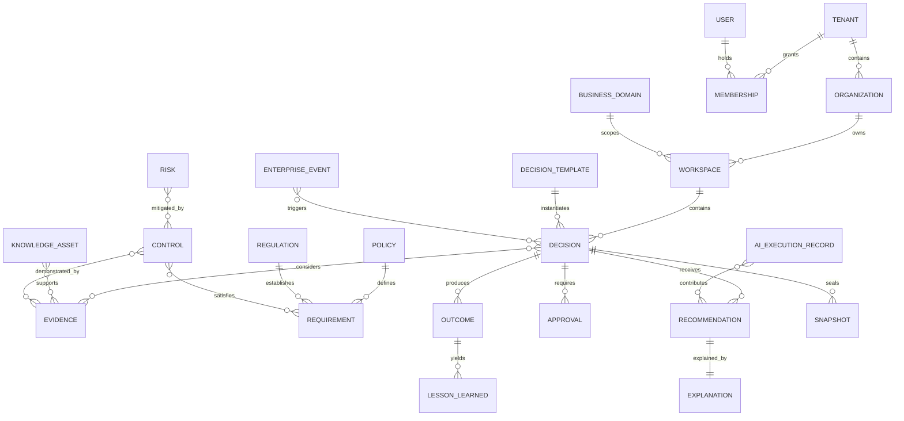

# Enterprise Domain Model

**Scope:** **Current** mappings and **Target** domain design. Every tenant-owned target record carries `tenant_id`; globally shared reference data, if introduced, is read-only and explicitly distinguished.

## Modeling approach

Use explicit aggregates and tables for concepts with distinct invariants. Provide a shared `EnterpriseObject` interface for common capabilities—stable ID, tenant, type, title, lifecycle, classification, ownership, timestamps, version, tags, relationships, and audit links—without forcing all fields into one table.

A selected shared `relationships` table and common attachment/comment/audit interfaces are appropriate. A universal-object or entity-attribute-value store is not: it weakens foreign keys, types, required-field validation, query planning, migrations, authorization review, and understandable audit history. JSON is acceptable for bounded, schema-versioned configuration or immutable calculation detail, not as a substitute for major domain entities.

## Identity, tenancy, and organization

| Entity | Purpose and ownership | Lifecycle / important attributes | Relationships, audit, current mapping |
| --- | --- | --- | --- |
| Tenant | Top security and data-isolation boundary; platform administration owns provisioning. | active/suspended/closed; slug, name, residency, retention, configuration version. Never silently reassigned. | Owns all customer records. Provisioning, suspension, export, deletion audited. **Current:** `Tenant`. |
| Organization | Legal or operating structure inside a tenant. | active/inactive; code, name, parent/effective dates in target. | Contains memberships/workspaces; structural changes audited. **Current:** `Organization`, one level only. |
| User | Human identity; identity service owns it. | invited/active/disabled; external subject, email/display name. Avoid tenant-owned profile data in global identity. | Membership supplies tenant context. Login/disable audited. **Current:** global `User` with password hash. |
| Membership | User's authorized presence in a tenant/organization. | invited/active/suspended/revoked; organization, clearance, effective dates. | Roles and delegations attach here. Changes audited. **Current:** `Membership`, unique per tenant/user and tied to one organization. |
| Business Domain | Governed vocabulary and scope such as Merchant Risk or Cybersecurity. | draft/active/retired; code, owner, taxonomy and pack/version origin. | Groups templates, risks, controls, policies, and workspaces. **Current mapping:** `BusinessConcept` partially organizes knowledge/decisions but is not this target concept. |
| Workspace | Collaboration and access scope, not the tenant boundary. | active/archived; organization, domain, name, owners, policy. | Contains decisions/assets. Membership does not follow merely from knowing its ID. **Current:** `Workspace`. |

## Decision and workflow

| Entity | Purpose and ownership | Lifecycle / important attributes | Relationships, audit, current mapping |
| --- | --- | --- | --- |
| Decision | Aggregate for a material choice and accountability. Owned by business owner. | Configured lifecycle; title, question, scope, type, owner, risk, impact, due date, version, final disposition/rationale. | Triggered by events; connects evidence, recommendations, approvals, outcomes, snapshots. Every transition audited. **Current:** `DecisionCase`, with supplier-specific fields and transparent readiness JSON. |
| Decision Type / Template | Versioned reusable semantics and requirements. Domain steward owns. | draft/published/deprecated; schema, workflow, roles, evidence/readiness/approval rules. Published versions immutable. | Instantiates decisions; comes from core or Decision Pack. **Current:** string `decision_type`, not a template. |
| Workflow | Versioned state machine definition and execution state. | draft/published/retired; states, transitions, guards, assignments, SLA, escalation. | One definition version per decision execution; transition facts append-only. **Current:** allowed status literals and direct service logic only. |
| Approval | A human accountability statement for a versioned subject. | requested/approved/rejected/withdrawn/expired; decision/snapshot version, approver role and actor, rationale, conditions. | Cannot be overwritten or transferred; superseding action appends. **Current:** Knowledge Card approver fields; no Decision Approval entity. |
| Comment / Discussion | Contextual collaboration that is not an approval or evidence fact. | active/edited/resolved/removed-under-policy; body, author, mentions, version. | Attached to authorized object; edits/deletions audited. **Current:** absent. |
| Attachment | Metadata and governed link to file content. | uploading/available/quarantined/archived/deleted-under-policy; hash, media type, size, storage key, scan status, classification. | Can support evidence but is not evidence automatically. **Current:** `SourceDocument` is a specialized precursor. |

## Evidence, knowledge, risk, and obligations

| Entity | Purpose and ownership | Lifecycle / important attributes | Relationships, audit, current mapping |
| --- | --- | --- | --- |
| Evidence | Governed support for an assertion, requirement, control, or decision. Evidence owner/reviewer owns fitness. | draft/in review/approved/rejected/expired/superseded/archived; assertion, source/version, locator, effective/expiry dates, authority, trust rationale, AI eligibility. | Cites source/asset and is snapshotted by decisions. Reviews and status changes audited. **Current:** `KnowledgeEvidence` and `DecisionEvidence` provide provenance/selection but lack full lifecycle/version snapshot. |
| Knowledge Asset | Governed reusable organizational knowledge. Knowledge owner owns it. | draft/in review/published/rejected/superseded/archived; type, content version, applicability, authority, classification, trust, AI eligibility. | Supported by evidence; indexed into chunks. **Current:** `KnowledgeCard`. |
| Risk | Uncertain effect on objectives. Risk owner owns assessment. | identified/assessed/treated/accepted/monitored/closed; taxonomy, inherent/residual assessments, appetite, owner, effective dates. | Mitigated by controls and considered by decisions. **Current:** `risk_level` on Decision Case only. |
| Control | Governed mechanism that modifies risk. Control owner owns design; operator owns execution. | proposed/designed/implemented/effective/deficient/retired; objective, type, frequency, effectiveness, testing, owner/operator. | Satisfies requirements; demonstrated by evidence; may have compensating controls. **Current:** named control areas in readiness JSON only. |
| Policy | Internal governing statement with versions. Policy owner owns it. | draft/approved/effective/superseded/retired; jurisdiction/scope, version, effective dates, approvers. | Decomposes into requirements. **Current:** no policy domain entity; `AccessPolicy` is authorization, not business policy. |
| Requirement | Atomic, testable obligation. Compliance owner owns interpretation. | proposed/effective/superseded/retired; text, source locator, applicability, test method, effective dates. | Derived from policy/regulation; satisfied by controls and evidence. **Current:** absent. |
| Regulation | External authority and versioned source metadata. Regulatory steward owns mapping, not the authority. | monitored/effective/amended/repealed; issuer, jurisdiction, citation, dates. | Establishes requirements and may trigger events. **Current:** absent. |

## Events, intelligence, outcomes, and history

| Entity | Purpose and ownership | Lifecycle / important attributes | Relationships, audit, current mapping |
| --- | --- | --- | --- |
| Enterprise Event | Normalized fact that may trigger or affect decisions. Source adapter/domain owner owns interpretation. | received/validated/correlated/processed/closed; source, external ID, type, severity, occurred/received time, payload reference, correlation. | Triggers workflows/decisions idempotently. **Current mapping:** Audit Event is not an Enterprise Event. |
| Recommendation | Proposed course of action, never the final accountable decision. | draft/generated/reviewed/accepted/rejected/superseded; structured observations, action, impact, confidence, required human action. | Supported by explanation and executions; linked to snapshot. **Current:** text and confidence on `DecisionCase`. |
| Explanation | Inspectable rationale. | immutable per recommendation version; factors, citations, missing/conflicts, calculations, assumptions, limitations. | References authorized evidence/knowledge/risk/policy/control facts. **Current:** readiness calculation JSON and UI score explanation are partial mapping. |
| Outcome | Observed result against expectations. Outcome owner owns measurement. | planned/observing/confirmed/inconclusive/closed; expected/actual, period, impacts, risk realization, control performance. | Closes decision loop and yields lessons. **Current:** absent. |
| Lesson Learned | Human-governed reusable learning. Knowledge steward owns promotion. | candidate/reviewed/published/rejected/superseded; statement, applicability, supporting outcomes, limitations. | May become Knowledge Asset or template proposal. **Current:** absent. |
| Relationship | Typed, provenance-bearing cross-domain edge. Owning module validates endpoints. | active/superseded/expired; type, direction, effective dates, confidence/rationale, source. | Tenant and authorization apply to both endpoints. **Current:** explicit foreign keys only; no general edge record. |
| Audit Event | Durable record of a material action. Audit service owns append contract. | append-only; actor/service, action, subject, before/after references, correlation, time, outcome, tenant. | Never used as mutable workflow state. **Current:** `AuditEvent` with JSON details. |
| AI Execution Record | Reproducibility and model-risk record. AI orchestration owns it. | created/completed/failed/reviewed; provider/model/digest, prompt version, parameters, inputs/retrieval/output/citations, timing/cost, reviewer/override. | Links to recommendation and snapshot. **Current:** absent; `QuestionAnswered` audit holds evidence count only. |
| Snapshot | Immutable decision-time reconstruction boundary. Decision service owns sealing. | sealed/superseded-under-correction; type, aggregate version, manifest, hashes, configuration/model/prompt/retrieval references. | Used for approval, historical reconstruction, and audit. **Current:** `DecisionEvidence` retains chunk IDs/scores but not immutable content/version manifest. |

## Aggregate and lifecycle rules

- This target model is a design catalog, not an instruction to create all entities immediately. Alembic and a verified baseline migration path are prerequisites to substantial production schema expansion. The initial generic Decision application boundary must wrap current `DecisionCase` persistence rather than preemptively creating target tables.
- Decision is the transaction boundary for transitions, recommendations, approval requests, and snapshot sealing; large binary content stays outside it.
- Knowledge Asset owns its versions and derived chunks; an approved Evidence record references an exact version.
- Policy owns immutable published versions and Requirement mappings; Control has its own lifecycle because operation/testing differs from policy publication.
- Workflow definitions, score models, prompts, and Decision Packs are immutable after publication; a new version is explicit.
- Deletes are exceptional and policy-driven. Legal/audit records are retained or cryptographically erased according to an approved retention design; ordinary UI “delete” must not erase accountability.

## Historical identity and time

Use stable logical IDs plus immutable version IDs, `valid_from`/`valid_to` for business effectiveness where applicable, and `created_at`/`superseded_at` for system history. A snapshot manifest references version IDs and content hashes. The system must distinguish “known at decision time” from “effective for the business period”; these are separate temporal questions.
