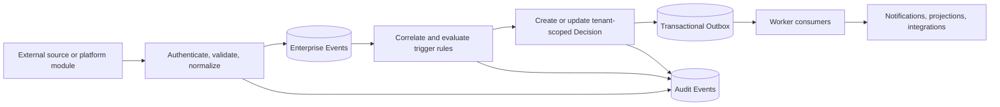
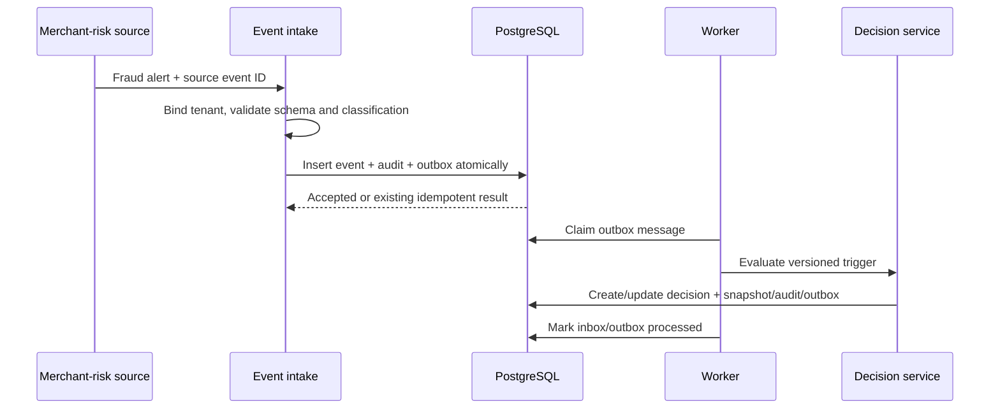

# Enterprise Event Model

## Purpose and stage-appropriate architecture

An **Enterprise Event** is a tenant-scoped business fact that can initiate, correlate with, or change a decision. It is distinct from an **Audit Event**, which records what DecisionVault or an actor did, and from an integration message, which is a delivery envelope.

**Current.** The worker polls PostgreSQL jobs and the application writes `AuditEvent` rows. There is no event bus or transactional outbox.

**Transitional.** Use PostgreSQL as the durable coordination point: an `enterprise_events` table for normalized facts, an `outbox_messages` table written in the same transaction as domain changes, and worker consumers with durable checkpoints/inbox deduplication. In-process dispatch is acceptable only after commit and only for non-critical work. This preserves simple operations and avoids a dual-write gap.

**Future.** Introduce a managed broker or streaming platform only when independently scaled consumers, sustained throughput, cross-system replay, latency, or organizational ownership justify it. Kafka is not a current requirement.

## Event envelope

| Field | Rule |
| --- | --- |
| `event_id` | DecisionVault stable UUID. |
| `tenant_id` | Resolved from authenticated integration/service identity or pre-bound connector; never trusted from an unbound payload. |
| `source` / `source_event_id` | Registered connector/system and its stable identifier. Unique with tenant/source for idempotency. |
| `event_type` / `schema_version` | Governed names such as `fraud.alert.raised`; consumers reject unsupported major schemas. |
| `severity` | Domain mapping to informational/low/medium/high/critical; preserve original value separately. |
| `occurred_at` / `received_at` | Source business time and platform receipt time. |
| `subject_refs` | Typed references such as merchant, vendor, control, policy, or decision; resolved within tenant. |
| `correlation_id` / `causation_id` | Trace related activity without treating correlation as proof. |
| `idempotency_key` | Required for retryable ingestion; uniqueness scoped by tenant and source. |
| `classification` / `access_policy_id` | Propagated before routing, workflow, analytics, or AI. |
| `payload_ref` / `payload_hash` | Versioned validated payload or secure external reference; minimize copied sensitive content. |
| `status` / `processing_version` | received, validated, correlated, processed, rejected, quarantined; rule version retained. |

## Sources and trigger examples

Sources may be authenticated APIs, approved batch imports, platform modules, or future connectors. Examples include fraud alert, regulatory bulletin, cybersecurity incident, vendor incident, policy change, control failure, audit finding, product launch, merchant-risk signal, and material operational change.

Trigger rules are versioned configuration from a Decision Pack or tenant customization. They may create a Decision, attach an event to an existing Decision, request reassessment, escalate severity, add an evidence requirement, or notify an accountable role. Material actions remain guarded by domain services; an event cannot bypass approval or authorization.

## Delivery semantics

- Use at-least-once delivery with idempotent consumers; do not promise exactly-once semantics.
- Insert business change, audit fact, and outbox message atomically.
- Consumers store `(tenant_id, consumer, message_id)` before committing effects or use an equivalent transactional inbox.
- Retry transient failures with bounded exponential backoff; quarantine/dead-letter permanent failures with redacted diagnostics and operator workflow.
- Preserve ordering only where required, using aggregate ID and sequence/version. Global event order is neither available nor necessary.
- Replay identifies the consumer/rule version and writes new processing facts; it must not rewrite original events or silently repeat external side effects.

## Correlation, isolation, and auditability

Correlation uses explicit subject identifiers, bounded time windows, and versioned rules. Fuzzy/AI-assisted correlation produces a proposed relationship with confidence and human review where consequences are material.

Every query, dedup key, relationship resolution, workflow trigger, projection, retry, and payload access is tenant-scoped. Connector credentials bind to one tenant or an explicitly governed administrative scope. A foreign-tenant subject reference is treated as absent.

Audit records capture receipt/rejection, normalization version, correlation decisions, workflows triggered, idempotent duplicates, manual replay, and operator intervention. Sensitive payloads are referenced rather than copied into logs or generic audit descriptions.

## Example sequence

## Governance and open questions

Event type owners publish schema, severity mapping, retention, sensitivity, trigger effects, and compatibility policy. Open choices include connector authentication standards, payload retention by jurisdiction, maximum replay horizon, notification delivery, throughput/service-level targets, and whether any future source requires ordered partitions or a broker.

