# Security and Multi-Tenancy Architecture

## Security objectives

DecisionVault must preserve confidentiality across tenants and classifications, integrity of decision/audit history, accountable authorization, availability appropriate to material decisions, and reproducibility without expanding access. Security controls apply before retrieval, ranking, analytics, relationship traversal, export, background processing, or AI disclosure.

## Verified current state

**Current.** Login uses tenant slug, email, and password. Passwords are Argon2-hashed through the configured library. HS256 JWTs contain user, tenant, and revocable session identifiers. Each protected request resolves an active user, tenant membership, and session, then roles and permissions. Tenant identity comes from `Principal`, not request tenant IDs.

Tenant-owned tables have `tenant_id`; repositories and APIs generally use explicit predicates. Knowledge retrieval applies tenant, publication, approval, AI-use, clearance, and access-policy filters before ranking. Storage keys begin with tenant ID. Dashboard cache entries are keyed by tenant. PostgreSQL RLS is not present. Current gaps relative to the target include broad/uneven object authorization, no service identity, no federation/MFA, local browser token storage, no break-glass model, limited AI execution audit, and no formal export control.

## Target authorization model

```mermaid
flowchart LR
  ID["Authenticated human or service"] --> T["Resolve tenant and membership"]
  T --> P["Role and permission policy"]
  P --> O["Object/workspace ownership and assignment"]
  O --> C["Classification, clearance and access policy"]
  C --> A["Action, lifecycle and segregation guard"]
  A --> Q["Tenant-scoped query or command"]
  Q --> U["Authorized result only"]
```

- Tenant resolution: bind the request to an authenticated session, federation assertion, or tenant-specific service credential. Administrative cross-tenant operation uses a separate platform-admin plane and explicit scope.
- Membership/organization: membership establishes tenant presence and organizational context; workspace access is separately checked where applicable.
- Roles/permissions: roles grant actions, not blanket data visibility. Permissions are stable codes; role definitions are tenant-scoped and version/audit changes.
- Classification/clearance: resource classification must not exceed principal clearance. Access policies further restrict by role/assignment/attribute.
- Object authorization: consider workspace access, ownership, assignment, conflicts, lifecycle, legal hold, and relationship endpoint access.
- Non-disclosure: foreign-tenant and absent IDs return equivalent results and timing where practical.
- Segregation: configurable policies prevent authors/operators from self-approving material evidence, controls, exceptions, or decisions.

## Tenant isolation patterns

All tenant-owned tables, joins, aggregates, uniqueness rules, relationship edges, jobs, audit records, snapshots, vector/lexical indexes, analytics projections, cache keys, object storage keys, and exports include tenant scope. Background workers derive tenant from the claimed tenant-owned job/source and verify referenced rows share it. Authorization filters execute before similarity ranking or limits to avoid restricted items displacing authorized results.

Testing includes positive and negative cross-tenant cases for direct IDs, nested routes, joins, updates/deletes, searches, aggregates, caches, jobs, files, relationships, exports, and AI inputs. A code-review checklist and tenant-aware repository helpers reduce omissions but do not replace tests.

## Application enforcement and PostgreSQL RLS

Application-level tenant filtering and authorization remain mandatory for SQL queries as well as non-SQL systems, files, caches, and AI, even if RLS is adopted. RLS is defense in depth against a missed SQL predicate, not a replacement for explicit application predicates; it also adds policy, connection-context, migration, worker, pool, and testing complexity.

Phased recommendation:

1. **Current/near term:** inventory every tenant-owned table/query, centralize tenant-aware repositories, add exhaustive isolation tests, constrain database roles, and add query review tooling.
2. **Transitional pilot:** after Alembic exists, prototype RLS on a small high-risk module. Set tenant context transaction-locally; use separate constrained runtime/migration roles; test connection-pool reset, jobs, admin operations, and failure behavior.
3. **Target:** expand only if the pilot is operable and measurable. Keep explicit application predicates for clarity and non-database controls. Do not use an RLS bypass role for ordinary runtime.

## Human and service identity

**Target.** Support enterprise federation (OIDC/SAML through a selected identity architecture), MFA policy, short-lived access, secure refresh/session handling, session/device revocation, and lifecycle provisioning. Service-to-service identities are workload-specific, tenant-bound where possible, least-privileged, short-lived, and distinguishable in audit. Secrets live outside source control, rotate, and have owner/expiry; provider keys are never browser-exposed.

## Files, exports, and administration

Files use tenant-prefixed opaque keys, content hashes, type/size validation, malware scanning before availability, encryption in transit/at rest, authorization on every download, and retention/legal-hold hooks. Avoid permanent public URLs. Export jobs capture requester, scope, classification, filters, justification where required, expiry, download audit, and reauthorization; watermark and DLP controls are risk-based.

Tenant administration, role changes, retention changes, exports, provider enablement, pack installation, model/prompt publication, and break-glass use require enhanced audit. Break-glass is **Target**: time-bound, reason/ticket-bound, strongly authenticated, approved or immediately alerted, read-only by default, explicitly tenant-scoped, and retrospectively reviewed.

## AI security boundaries

- Authorize and classify before retrieval; pass only minimum necessary content to an allowed provider.
- Treat uploaded/retrieved content as untrusted data, never instructions. Delimit it and prohibit tools/actions from following embedded commands.
- Use structured output schemas, allowlisted tools, constrained URLs/connectors, output validation, citation verification, and human approval for material actions.
- Record provider/model/prompt and disclosed input references. Apply tenant provider/region/retention policy and prohibit provider training where contractually required.
- Prevent cross-tenant caches, conversational memory, evaluation datasets, vector indexes, logs, and prompt traces.
- Support model-disabled operation and deterministic fallback without weakening authorization.

## Audit, monitoring, and incident response

Audit records include actor/service, tenant, action, object/version, outcome, time, correlation, authorization decision reference, and material before/after facts. They are append-only at the application contract; access and exports are restricted. A future tamper-evident archive requires a separate threat/retention decision.

Security monitoring covers authentication abuse, permission/admin change, unusual exports/downloads, cross-tenant denials, break-glass, audit pipeline failure, provider/data-egress violations, file quarantine, and job anomalies. Playbooks define containment, tenant impact analysis, evidence preservation, credential rotation, notification decisions, recovery, and lessons.

## Unresolved choices

Identity provider/federation standard, MFA assurance levels, token storage/refresh design, customer-managed keys, regional residency, retention/legal hold, audit immutability, malware scanning provider, export/DLP policy, RLS acceptance criteria, service identity mechanism, and provider contractual controls require threat modeling and customer/regulatory requirements.
