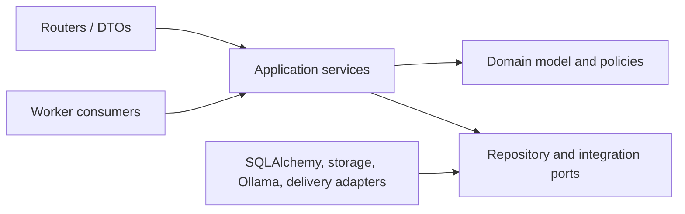

# Service and Module Boundaries

## Deployment strategy

**Current.** FastAPI contains routers, services, repositories, ORM models, authentication dependencies, dashboard logic, and retrieval; a separate polling worker performs ingestion. Boundaries are emerging for Knowledge and Business Concepts but are not uniform.

**Transitional.** Keep one backend deployable and organize it as modules with explicit application services, DTOs, repositories, policies, and emitted events. Modules may share the same PostgreSQL instance but must not mutate another module's tables except through its public application interface. The worker calls the same application contracts or consumes versioned commands/events.

**Target.** Logical boundaries below are not a mandate for microservices. Extraction requires measured operational need and a plan for identity, tenancy, transactions, observability, compatibility, and data ownership.

Decision Packs configure the modular monolith through validated, versioned data. A pack is not a deployable service and cannot introduce containers, network endpoints, executable tenant code, or infrastructure.

## Boundary catalog

“Events” below are target domain/outbox events. All public interfaces require tenant-derived identity, authorization, validation, correlation, and stable errors.

| Module | Responsibilities / owned data | Non-responsibilities | Interfaces and events | Security requirements |
| --- | --- | --- | --- | --- |
| Identity & Access | Users/identity links, credentials or IdP binding, sessions, roles, permissions, delegations. | Business policy, workflow state. | Login/logout/session APIs; `SessionRevoked`, `MembershipAuthorizationChanged`. | Strong credential handling, revocation, rate limits, MFA/federation target, audit. |
| Tenancy & Organization | Tenant provisioning/state, organizations, memberships, residency/retention configuration. | Domain-object authorization decisions alone. | Admin APIs; `TenantSuspended`, `MembershipChanged`. | Privileged admin controls; no caller-selected tenant authority. |
| Workspace & Business Domain | Workspaces, domain taxonomy, ownership/access context. | Decisions or knowledge content. | Workspace/domain APIs; `WorkspaceArchived`, `DomainVersionPublished`. | Tenant and object policy checks. |
| Decision Management | Decision aggregate, templates reference, lifecycle commands, snapshots, outcome links. | AI generation, policy authoring. | Decision command/query API; consumes Enterprise Events; emits `DecisionCreated`, `DecisionTransitioned`, `DecisionSnapshotSealed`. | Object authorization, optimistic concurrency, transition guards, immutable final facts. |
| Evidence Management | Evidence assertions, provenance, fitness, review, expiry, decision evidence manifests. | Raw extraction and general knowledge authoring. | Evidence APIs; emits `EvidenceApproved`, `EvidenceExpired`, `EvidenceSuperseded`. | Classification, lineage, reviewer authority, authorization before citation. |
| Knowledge Management | Knowledge Assets/versions, governance, chunks/index requests. | Deciding evidence fitness for every decision; AI generation policy. | Knowledge APIs; emits `KnowledgePublished`, `KnowledgeSuperseded`, `IndexRequested`. | Clearance/access policy before search/index/AI. |
| Risk & Control | Taxonomies, assessments, treatments, controls, tests, effectiveness, exceptions/compensating controls. | Regulatory source ownership, decisions. | Risk/control APIs; emits `ControlFailureRecorded`, `RiskAssessmentChanged`. | Segregation of owner/operator/tester where configured. |
| Policy & Requirement | Policies/versions, regulations metadata, atomic requirements, applicability and mappings. | Access-control policies. | Policy/requirement APIs; emits `PolicyPublished`, `RequirementChanged`. | Publication approval, effective dating, jurisdiction-aware access. |
| Workflow | Definitions/versions, executions, assignments, timers, escalation and transition evaluation. | Domain invariants, identity source, sending notifications. | Commands and timer jobs; emits `TaskAssigned`, `SlaBreached`, `TransitionAvailable`. | Safe rule DSL, role resolution, no arbitrary code. |
| Approval | Approval requests and append-only responses, conditions, segregation checks. | General comments or status mutation. | Approval commands; emits `ApprovalRequested`, `ApprovalRecorded`. | Actor intent, subject version binding, non-repudiation appropriate to risk. |
| Discussion | Comments, threads, mentions, resolution. | Evidence or approval semantics. | Discussion APIs; `MentionCreated`. | Object-level authorization and content audit. |
| Audit | Append-only material action records, correlation, protected audit queries/export. | Primary workflow or event bus. | Append/query/export contracts. | Tamper evidence target, restricted export, retention/legal hold. |
| Relationship | Typed cross-domain edges and bounded traversal. | Owning endpoint lifecycle. | Link/traversal APIs; `RelationshipEstablished/Superseded`. | Authorize both endpoints and results; prevent inference leaks. |
| Search & Retrieval | Authorized lexical/vector query, ranking, retrieval snapshots, index coordination. | Content governance, final recommendations. | Search/retrieve APIs; consumes index events; emits evaluation telemetry. | Filter before ranking; query/result classification; tenant-safe indexes/caches. |
| AI Orchestration | Provider adapters, prompt/model registry, structured execution, guardrails, citations, execution records, evaluation. | Final approval or unreviewed state mutation. | Execute/evaluate APIs and jobs; emits `AIExecutionCompleted/Failed/Reviewed`. | Provider egress policy, prompt-injection defenses, minimum disclosure, human gates. |
| Analytics | Metric definitions, projections, rollups, trends, executive read models. | Transactional source of truth. | Query APIs; consumes domain events. | Security-aware projections/caches and minimum cohort rules where needed. |
| Notification | Templates, preferences, delivery attempts and escalation routing. | Workflow truth or secrets in message bodies. | Enqueue/status APIs; consumes assignment/SLA events. | Tenant-approved channels, redaction, signed links, retry/idempotency. |
| Reporting & Export | Versioned report definitions, asynchronous rendering, governed exports. | Analytics definitions or authorization bypass. | Report jobs/downloads; emits `ExportCreated/Downloaded/Expired`. | Reauthorize download, watermark/classification, expiry, audit/export control. |
| File Storage | File metadata, content-address/hash operations, secure upload/download, malware status and retention hooks. | Evidence authority. | Pre-authorized transfer/application APIs; `FileAvailable/Quarantined`. | Tenant-prefixed keys, encryption, scan, short-lived access, no public bucket. |
| Background Jobs | Durable job lifecycle, claim/lease, retry, cancellation, progress, inbox/outbox. | Domain logic. | Job APIs/worker contracts; emits job status events. | Tenant inheritance from source, idempotency, redacted errors, bounded leases. |

## Dependency rules

- Routers translate protocol concerns; they do not calculate business scores or write ORM records directly.
- Domain code does not import FastAPI, SQLAlchemy, provider SDKs, or worker runtime.
- Repositories expose aggregate-specific tenant-scoped operations, not generic unfiltered query objects.
- Cross-module synchronous calls use application interfaces; asynchronous consequences use the outbox.
- Query read models may denormalize across modules but are read-only, tenant-scoped, versioned, and traceable to sources.
- Shared libraries are limited to primitives such as IDs, time, pagination, errors, security context, correlation, and event envelope—not shared business logic.

## Extraction criteria

Consider independent deployment only when at least one boundary needs materially different scaling or availability, sensitive isolation, separate release cadence/ownership, or specialized runtime, and when the benefit exceeds distributed transaction, latency, compatibility, deployment, and incident complexity. Search/indexing or asynchronous AI execution are plausible first candidates; neither is currently required.

## Transitional sequence

1. Establish Alembic and verify the baseline migration path before substantial production schema expansion.
2. Establish uniform DTO/error/correlation conventions and move current Decision logic behind a tenant-scoped application boundary without introducing target domain tables.
3. Expand tenant-isolation and authorization tests around that boundary.
4. In later, separately reviewed PRs, remove supplier-only concepts through deliberate migrations and add aggregate versions, durable jobs, an audit writer, and transactional outbox.
5. Introduce explicit Evidence, Risk/Control, Policy/Requirement, Workflow/Approval, Snapshot, and Outcome modules in thin vertical slices.
6. Add security-aware projections and AI orchestration adapters after governance contracts exist.
